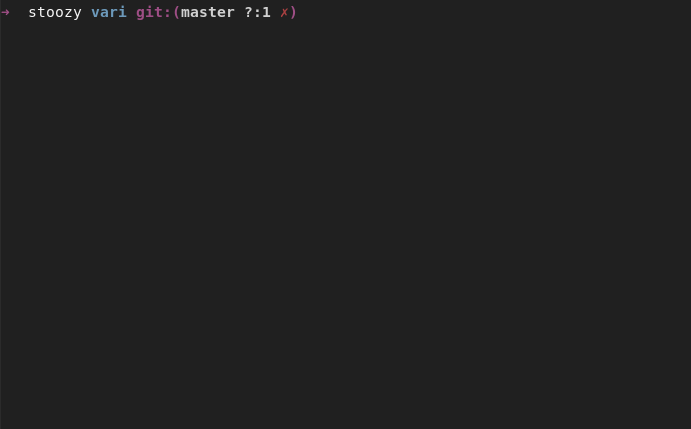

### Welcome to vari

Vari is a hobby programming language made in rust.

### Motivation

First and foremost, this project is for learning purposes.

Secondly, in the case that  this goes well, I intend to combine both
dynamic typing from languages like javascript and python with
the performance of low level C/C++ code (by compiling it to
machine code) to get the best of both worlds.

This can allow beginners to write performant code without worrying about
a type system.

### Install & Run

To get started, go grab the rust toolchain [here](https://www.rust-lang.org/tools/install) (if you don't have one already). 

Then run the following:

-   `git clone https://github.com/Stoozy/vari.git`
-   `cd vari`
-   `cargo build`

To run with a source file:

-   Write some code in vari and save it 
-   Run `cargo run -- <source>` or `./target/debug/vari <source>`

Note: running without a input source file will drop you in the REPL.

### Contributing 

Feel free to open an Issue/PR regarding any part of the project.

### Acknowledgements

Crafting Interpreters by Robert Nystrom